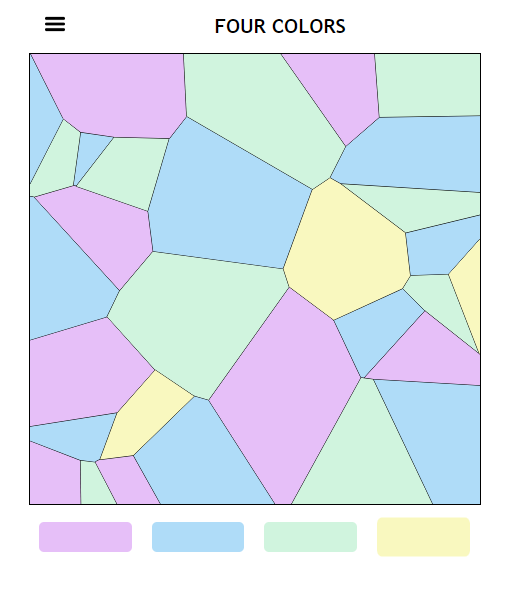

# Four colors

Simple web-based game that leverages on the Four color theorem. The goal of the game is to color all the regions of the "map" in a way that 2 adjacent regions always have different colors.

